# Demostraciones de funcionamiento entre el cliente y la base de datos

A continuación muestro resultados de las pruebas ejecutadas para verificar que el cliente es seguro. 
A lo largo de las ejecuciones se comprueban los siguientes casos: 

## Mal cuerpo de mensaje

Si se intenta enviar un cuerpo que no sea JSON aparecer el siguiente error:  

**Datos enviados**
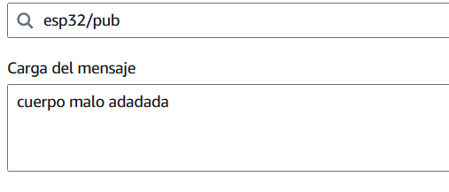

**Datos recibidos**
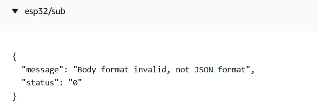

## Cuerpo incorrecto

Si se intenta enviar un cuerpo JSON pero con campos incorrectos:  

**Datos enviados**
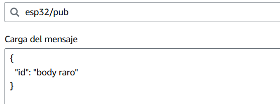

**Datos recibidos**
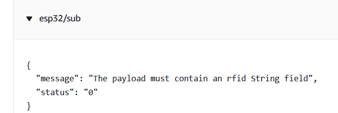

## ID incorrecto

Si se intenta enviar un cuerpo correcto pero con un rfid falso:  

**Datos enviados**
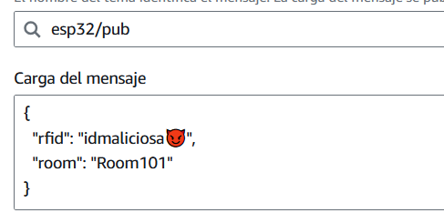

**Datos recibidos**
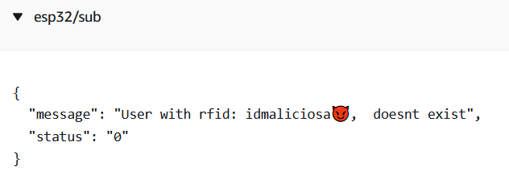

## Sala/aula incorrecta

Si se intenta enviar un cuerpo correcto pero con una aula falsa:  

**Datos enviados**
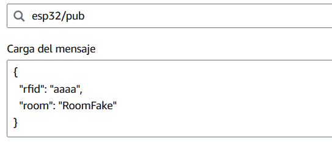

**Datos recibidos**
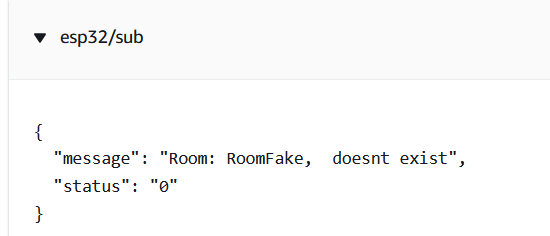

## Aula no asignada

Si los datos son reales, pero se comprueba que el rfid no se de alguien con acceso a esa aula en la hora actual:  

**Datos enviados**
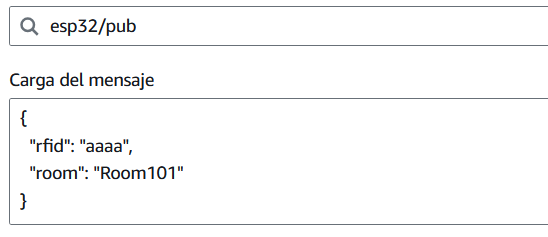

**Datos recibidos**
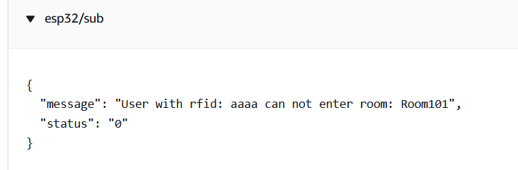

## Datos correctos y acceso permitido

Si los datos son reales, pero se comprueba que el rfid no se de alguien con acceso a esa aula en la hora actual:  

**Datos enviados**
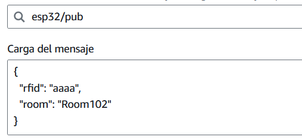

**Datos recibidos**
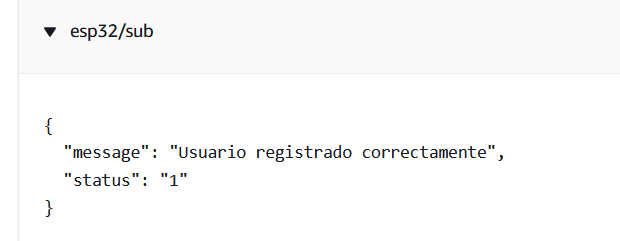

**Demostración**
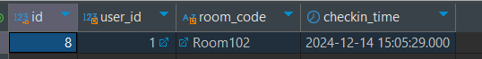

